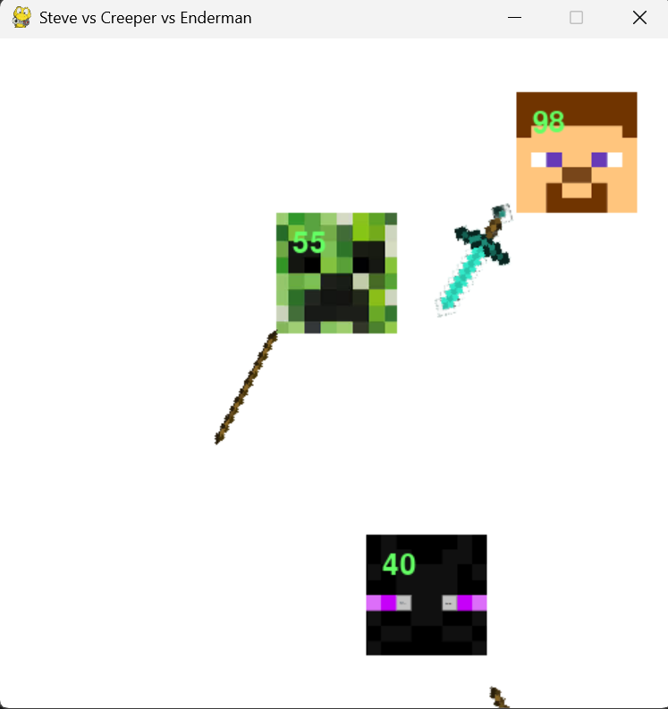

Ball Battle Stimulator
A physics-based battle arena where circles equipped with rotating weapons fight to the death. Watch as three warriors bounce, collide, and battle until only one remains standing.
Inspired by viral social media combat videos, this project demonstrates object-oriented programming, collision physics, and real-time game mechanics using PyGame.



Gameplay
Three circles move autonomously around the screen, each with:
- Unique weapon rotating around them at different angles
- Physics-based movement with realistic collisions
- Health points displayed on each circle
When a weapon touches an enemy circle, that circle loses HP. When two weapons collide, they bounce off each other and reverse rotation direction. The last circle with HP remaining wins the match!

Controls
The game is fully automated — sit back and watch the battle unfold!

Installation
Prerequisites:
- Python 3.7 or higher
- pip (Python package manager)
Steps:
```bash
# 1. Clone the repository
git clone https://github.com/kwwwchan/Ball-Battle-Stimulator.git
cd Ball-Battle-Stimulator

# 2. Install PyGame
pip install pygame

# 3. Run the game
python game.py
